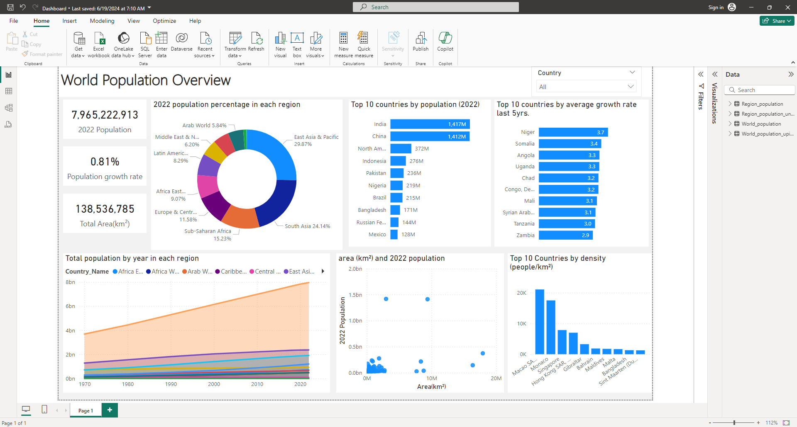

# World population Analysis 


# Objective 

Finding out how the population has changed over the years and identify top countries in terms of population, growth rate, density and area.


# Data source 

The dataset is from the World Bank. [click here to find it.](https://databank.worldbank.org/reports.aspx?source=2&series=SP.POP.TOTL&country=)


There are five datasets
- Total Population
- Male Population
- Female Population
- Growth rate
- Area


# ETL

## Steps

1. Explore the data in Excel
2. Load the data into SQL Server
3. Clean and transform the data with SQL
4. Visualize the data in Power BI

### Data exploration notes

Replace the value (..) with blank to indicate null values


### Transform the data 

After loading the data into SQL Server, start the transformation process


```sql
/*
First, get growth rate for latest year and the avgerage for last 5 years
and put it in a CTE
*/

WITH growthCTE AS
(
	SELECT 
		Country_Name,
		Country_Code,
		(_2022_YR2022 + _2021_YR2021 + _2020_YR2020 + _2019_YR2019 + _2018_YR2018) / 5 AS Average_growth_rate_last_5yrs,
		_2022_YR2022 AS Growth_rate_2022
	FROM Growth
),
```

```sql

-- 1. Next, Get female population and male population from thier tables and join them with the Total population table along with the growth rate from the growthCTE
-- 2. Join with Area table in order to get the area
-- 3. Calculate population percentage of each country and region and the population density and put the result inside another CTE
all_population AS
(
	SELECT
		p.Country_Name,
		p.Country_Code,
		p.YR1970,
		p.YR1980,
		p.YR1990,
		p.YR2000,
		p.YR2014,
		p.YR2015,
		p.YR2016,
		p.YR2017,
		p.YR2018,
		p.YR2019,
		p.YR2020,
		p.YR2021,
		p.YR2022,
		g.Average_growth_rate_last_5yrs,
		g.Growth_rate_2022,
		mp._2022_YR2022 AS male_population_2022,
		fp._2022_YR2022 AS female_population_2022,
		YR2022 * 1.0 / (SELECT YR2022 FROM Total_population WHERE Country_Name = 'World') AS percentage_of_world_population_2022,
		a._2021_YR2021 AS [Area(km²)],
		(p.YR2022 /a._2021_YR2021) AS [population_density(people/km²)]
	FROM Total_population p
		JOIN growthCTE g
		ON p.Country_Name = g.Country_Name
		JOIN Male_population mp
		ON p.Country_Name = mp.Country_Name
		JOIN Female_population fp
		ON p.Country_Name = fp.Country_Name
		JOIN Area a
		ON p.Country_Name = a.Country_Name
)

```

### Split the Regions and Countries
```sql
---- Store the regions into a seperate table
SELECT *
INTO Region_population
FROM all_population
WHERE Country_Name IN (
	'East Asia & Pacific',
	'Europe & Central Asia',
	'South Asia',
	'Africa Eastern and Southern',
	'Africa Western and Central',
	'Middle East & North Africa',
	'Sub-Saharan Africa',
	'Arab World',
	'Caribbean small states',
	'Central Europe and the Baltics',
	'Latin America & Caribbean',
	'Pacific island small states',
	'World'
)

```

```sql
-- keep the countries by removing the regions and anything that's not a country and storing the result in a new table

SELECT *
INTO World_population
FROM all_population
WHERE Country_Name NOT IN (
	'East Asia & Pacific',
	'Europe & Central Asia',
	'South Asia',
	'Africa Eastern and Southern',
	'Africa Western and Central',
	'Middle East & North Africa',
	'Sub-Saharan Africa',
	'Arab World',
	'Caribbean small states',
	'Central Europe and the Baltics',
	'Latin America & Caribbean',
	'Pacific island small states',
	'World'
)
AND Country_Name NOT LIKE '%IBRD%'
AND Country_Name NOT LIKE '%IDA%'
AND Country_Name NOT LIKE '%income%'
AND Country_Name NOT LIKE '%demographic%'
AND Country_Name NOT LIKE '%Euro%'
AND Country_Name NOT LIKE '%situations%'
AND Country_Name NOT LIKE '%HIPC%'
AND Country_Name NOT LIKE '%OECD%'
AND Country_Name NOT LIKE '%states%'
AND Country_Name NOT LIKE '%developed%'


```

# Visualization

- What does the dashboard look like?

